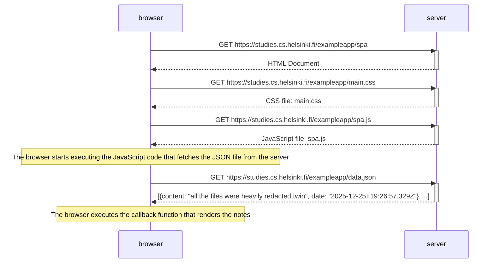

```mermaid
    sequenceDiagram
        participant browser
        participant server

        browser->>server: GET https://studies.cs.helsinki.fi/exampleapp/spa
        activate server
        server-->>browser: HTML Document
        deactivate server

        browser->>server: GET https://studies.cs.helsinki.fi/exampleapp/main.css
        activate server
        server-->>browser: CSS file: main.css
        deactivate server

        browser->>server: GET https://studies.cs.helsinki.fi/exampleapp/spa.js
        activate server
        server-->>browser: JavaScript file: spa.js
        deactivate server
        Note over browser: The browser starts executing the JavaScript code that fetches the JSON file from the server

        browser->>server: GET https://studies.cs.helsinki.fi/exampleapp/data.json
        activate server
        server-->>browser: [{content: "all the files were heavily redacted twin", date: "2025-12-25T19:26:57.329Z"},…]
        deactivate server
        Note over browser: The browser executes the callback function that renders the notes
```