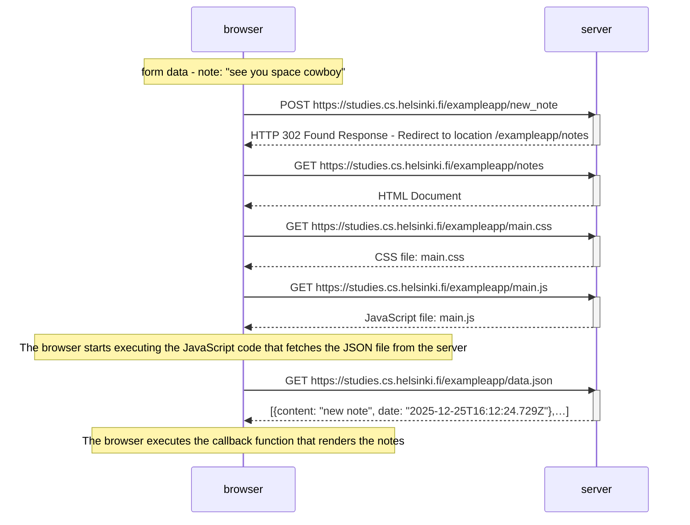

```mermaid
    sequenceDiagram
        participant browser
        participant server

        Note over browser: form data - note: "see you space cowboy"
        browser->>server: POST https://studies.cs.helsinki.fi/exampleapp/new_note
        activate server
        server-->>browser: HTTP 302 Found Response - Redirect to location /exampleapp/notes
        deactivate server

        browser->>server: GET https://studies.cs.helsinki.fi/exampleapp/notes
        activate server
        server-->>browser: HTML Document
        deactivate server

        browser->>server: GET https://studies.cs.helsinki.fi/exampleapp/main.css
        activate server
        server-->>browser: CSS file: main.css
        deactivate server

        browser->>server: GET https://studies.cs.helsinki.fi/exampleapp/main.js
        activate server
        server-->>browser: JavaScript file: main.js
        deactivate server
        Note over browser: The browser starts executing the JavaScript code that fetches the JSON file from the server

        browser->>server: GET https://studies.cs.helsinki.fi/exampleapp/data.json
        activate server
        server-->>browser: [{content: "new note", date: "2025-12-25T16:12:24.729Z"},…]
        deactivate server
        Note over browser: The browser executes the callback function that renders the notes
```