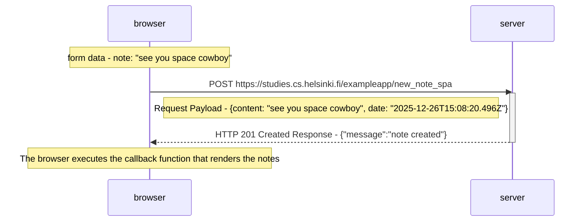

```mermaid
    sequenceDiagram
        participant browser
        participant server

        Note over browser: form data - note: "see you space cowboy"
        browser->>server: POST https://studies.cs.helsinki.fi/exampleapp/new_note_spa
        activate server
        Note right of browser: Request Payload - {content: "see you space cowboy", date: "2025-12-26T15:08:20.496Z"}
        server-->>browser: HTTP 201 Created Response - {"message":"note created"}
        deactivate server
        
        Note over browser: The browser executes the callback function that renders the notes
```